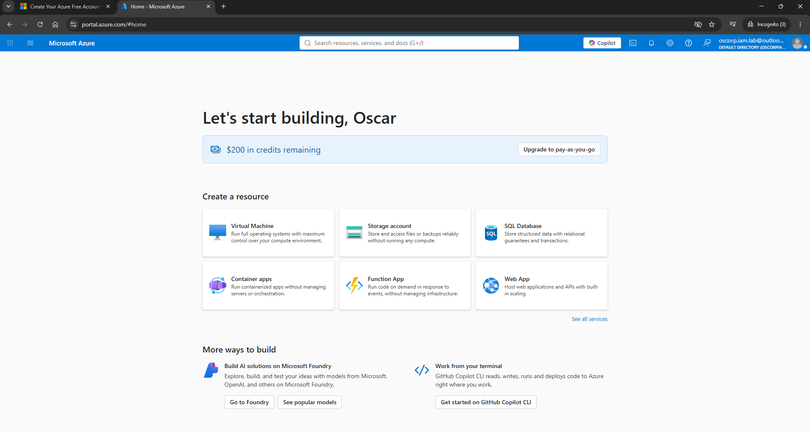

# Environment Setup — Creating the OsCorp IAM Lab 🔐

Before beginning the IAM learning journey, I created a dedicated Microsoft/Azure environment to use as a safe, isolated laboratory.

The goal is to build a fictional company called **OsCorp** and use it as the environment for experimenting with Microsoft Entra ID, Active Directory, authentication, authorization, access control, identity governance and IAM security.

> **Important:** This is a fictional lab environment. All users, groups, applications and resources created during the journey are for learning and testing purposes only.

---

## 1. Create a Dedicated Microsoft Account

I first created a separate Microsoft account specifically for the IAM laboratory.

### Why use a separate account?

Using a dedicated account keeps the lab environment separate from personal and production identities.

It also allows the lab to be documented and eventually shared as a standalone technical portfolio.

### Lab identity

**Organisation:** OsCorp

**Purpose:** IAM / Azure / Microsoft Entra learning laboratory

The account should not be used for personal services or production workloads.

---

## 2. Create an Azure Free Account

I then signed up for an **Azure Free Account** using the dedicated lab Microsoft account.

Microsoft currently provides eligible new Azure customers with:

* USD $200 Azure credit
* 30 days to use the credit
* Free monthly amounts for selected Azure services
* 65+ always-free services
* Spending protection while using the free-account offer

The $200 credit can be used to experiment with Azure services during the 30-day period.

### Important

The Azure Free Account is designed for experimentation.

I will **not immediately deploy expensive resources**.

The objective is to use free services wherever possible and reserve the Azure credit for labs where paid resources provide genuine learning value.

---

## 3. Azure Free Account Confirmation

After completing registration, I signed into the Azure Portal using the dedicated OsCorp laboratory account.

The Azure home page confirmed:

**$200 in credits remaining**

This confirms that the Azure Free Account was successfully activated.

### Screenshot



---

## 4. Lab Environment Design

The fictional organisation used throughout this journey is:

# OsCorp

The environment will gradually evolve as new IAM concepts are introduced.

The initial architecture is:

```text
                         OSCORP
                           │
                           ▼
                  Microsoft Entra ID
                           │
          ┌────────────────┼────────────────┐
          │                │                │
        Users            Groups        Applications
          │                │                │
          └────────────────┼────────────────┘
                           │
                    Access Policies
                           │
             ┌─────────────┼─────────────┐
             │             │             │
            RBAC      Conditional      PIM
                       Access
             │             │             │
             └─────────────┼─────────────┘
                           │
                        Resources
```

This architecture will grow as the journey progresses.

---

## 5. Microsoft Entra ID

Microsoft Entra ID is the identity platform that will form the foundation of the OsCorp cloud identity environment.

A Microsoft Entra tenant represents an organisation and provides a dedicated identity environment containing its users, groups, applications and other identity objects.

The Azure account created above provides the starting point for the OsCorp identity environment.

### Initial objectives

The first stage of the laboratory will be to create:

* OsCorp users
* Security groups
* Department structure
* Test identities
* Group memberships
* Authentication scenarios
* Authorization scenarios

Later stages will introduce:

* Enterprise applications
* App registrations
* Service principals
* RBAC
* Conditional Access
* MFA
* Privileged Identity Management
* Identity Governance
* Managed identities
* Hybrid Active Directory
* Microsoft Graph
* IAM automation

---

## 6. Cost Management Strategy

The Azure credit will be treated as a limited laboratory budget.

### Rules for this lab

1. Use Microsoft Entra ID Free capabilities where possible.
2. Avoid creating resources simply because they are available.
3. Stop or delete compute resources when they are not being used.
4. Check Azure Cost Management regularly.
5. Document the cost of significant resources.
6. Never store secrets, passwords, tokens or private keys in GitHub.
7. Use fictional identities and data wherever possible.

Microsoft provides free service allowances in addition to the Azure credit, so not every lab requires consuming the $200 balance.

---

## 7. Lab Safety

This environment is intended for experimentation.

No real:

* passwords
* customer information
* company information
* production credentials
* API keys
* certificates/private keys
* personal data

should be committed to the repository.

Screenshots should also be reviewed before uploading them to GitHub.

Sensitive information such as:

* tenant IDs where unnecessary
* subscription IDs
* email addresses
* usernames
* secrets
* access tokens

should be removed or redacted when appropriate.

---

# Environment Status

| Component                   | Status      |
| --------------------------- | ----------- |
| Dedicated Microsoft account | ✅ Complete  |
| Azure Free Account          | ✅ Complete  |
| $200 Azure credit           | ✅ Available |
| OsCorp lab concept          | ✅ Defined   |
| Microsoft Entra environment | 🔄 Next     |
| Test users                  | ⏳           |
| Security groups             | ⏳           |
| IAM labs                    | ⏳           |

---

# Next Step

## Day 1 — IAM Fundamentals

The first practical lab will demonstrate:

```text
Identity
   ↓
Authentication
   ↓
Authorization
   ↓
Access Control
   ↓
Resource
```

The first OsCorp identities and security groups will be created and used to demonstrate these concepts in practice.

**Environment setup complete. 🔐**
