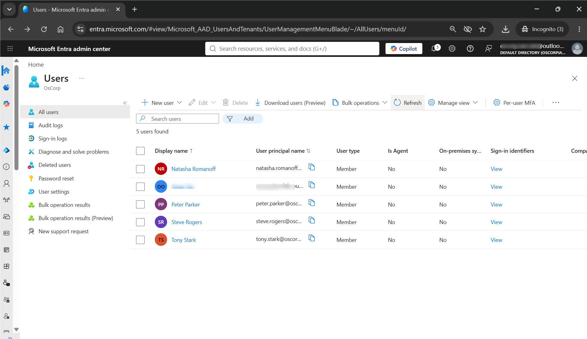
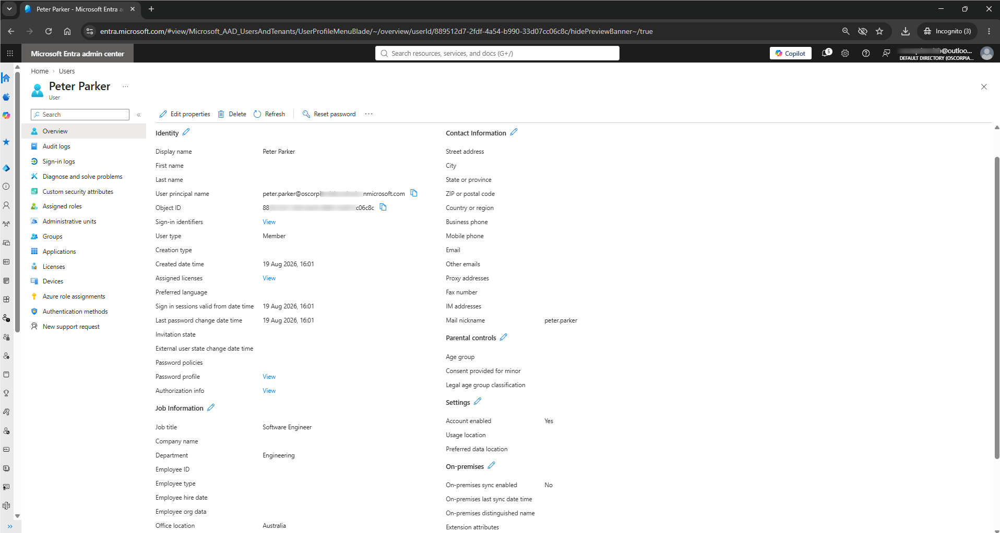
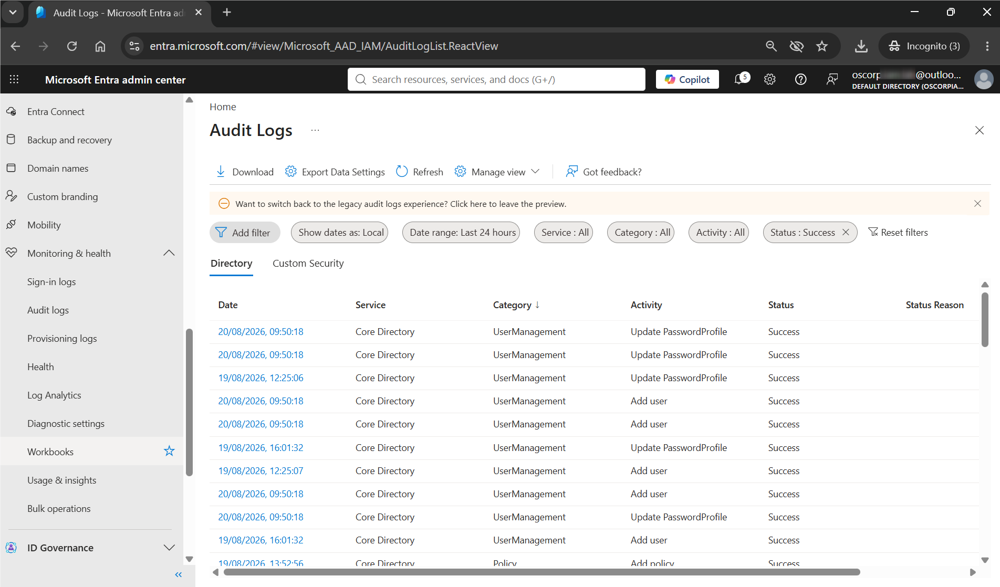
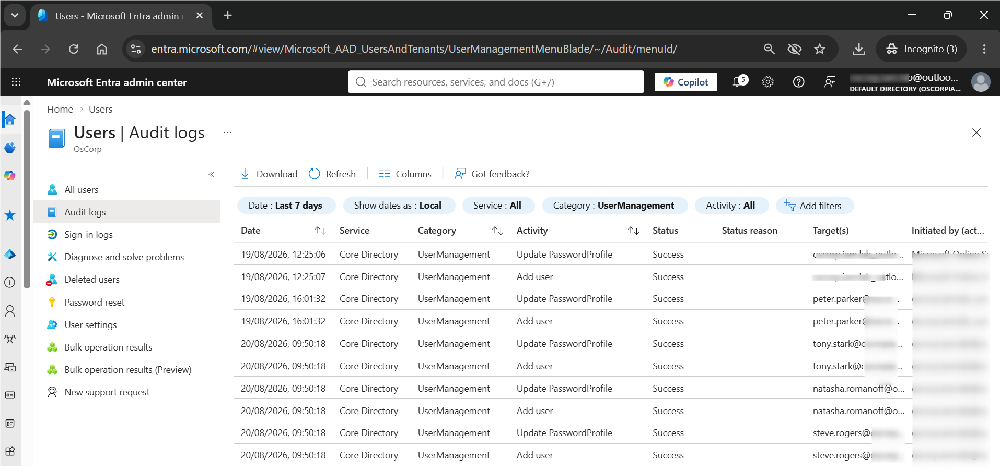

# Lab 01 — User Provisioning 🔐

## Lab Status

**Status:** 🔄 In Progress

**Platform:** Microsoft Entra ID

**Organisation:** OsCorp

**Environment:** Azure / Microsoft Entra ID Free

---

## 1. Objective

The objective of this lab is to provision fictional OsCorp user identities in Microsoft Entra ID using a defined identity naming standard.

The lab will demonstrate the basic identity lifecycle involved in creating and validating user accounts.

The focus is not only on creating the accounts, but also on understanding:

- Identity provisioning
- User attributes
- Naming standards
- Account status
- Identity validation
- Group membership preparation
- Audit evidence
- Basic troubleshooting

---

## 2. Scenario

OsCorp is onboarding several fictional employees into its cloud identity environment.

As part of the onboarding process, an IAM administrator has been asked to create the required user identities in Microsoft Entra ID.

The administrator must:

1. Create the required user accounts.
2. Apply the established naming convention.
3. Populate appropriate identity attributes.
4. Ensure the accounts are enabled.
5. Avoid assigning unnecessary administrative privileges.
6. Validate the created identities.
7. Confirm that the provisioning activity appears in the audit logs.
8. Document the evidence.

This simulates a simplified enterprise user-provisioning request.

---

## 3. Lab Identities

The identities used in this lab are fictional and are based on characters from the Spider-Man and Marvel Cinematic Universe (MCU) universes.

They are used purely for educational and demonstration purposes.

| User | Department | Job Title | UPN |
|---|---|---|---|
| Peter Parker | Engineering | Software Engineer | `peter.parker@<tenant-domain>` |
| Tony Stark | Technology | Technology Architect | `tony.stark@<tenant-domain>` |
| Natasha Romanoff | Security | Security Analyst | `natasha.romanoff@<tenant-domain>` |
| Steve Rogers | Operations | Operations Manager | `steve.rogers@<tenant-domain>` |

> The actual tenant domain is intentionally represented as `<tenant-domain>` in the documentation where appropriate.

---

## 4. Naming Standards

OsCorp uses the following naming standard for user identities.

### User Principal Name (UPN)

The standard is:

`firstname.lastname`

Examples:

- `peter.parker`
- `tony.stark`
- `natasha.romanoff`
- `steve.rogers`

The tenant domain is appended automatically by Microsoft Entra ID.

### Display Name

Display names follow:

`FirstName LastName`

Examples:

- `Peter Parker`
- `Tony Stark`
- `Natasha Romanoff`
- `Steve Rogers`

### Security Groups

Security groups use:

`SG-<Department>-Users`

Examples:

- `SG-Engineering-Users`
- `SG-Technology-Users`
- `SG-Security-Users`
- `SG-Operations-Users`

The `SG` prefix is an OsCorp laboratory naming convention and does not represent an Entra group type, scope, or permission level.

---

## 5. Provisioning Requirements

Each user account should meet the following requirements:

- Account is created in the OsCorp Microsoft Entra tenant.
- User Principal Name follows the defined naming convention.
- Display name is correct.
- Department is populated.
- Job title is populated.
- Account is enabled.
- No unnecessary administrative role is assigned.
- Temporary credentials are generated securely.
- Credentials are not stored in GitHub.
- User creation is visible in the Entra audit logs.

---

## 6. Implementation

### Step 1 — Open Microsoft Entra Users

Navigate to:

**Microsoft Entra admin center → Entra ID → Users → All users**

Select:

**+ New user**

---

### Step 2 — Create Peter Parker

Create a new user with the following information:

**Display name:**

`Peter Parker`

**User principal name:**

`peter.parker`

**Department:**

`Engineering`

**Job title:**

`Software Engineer`

**Usage location:**

`Australia`

Allow Microsoft Entra ID to generate a temporary password.

The temporary password must not be stored in this repository.

---

### Step 3 — Create Tony Stark

Create:

**Display name:**

`Tony Stark`

**User principal name:**

`tony.stark`

**Department:**

`Technology`

**Job title:**

`Technology Architect`

**Usage location:**

`Australia`

Allow Microsoft Entra ID to generate a temporary password.

---

### Step 4 — Create Natasha Romanoff

Create:

**Display name:**

`Natasha Romanoff`

**User principal name:**

`natasha.romanoff`

**Department:**

`Security`

**Job title:**

`Security Analyst`

**Usage location:**

`Australia`

Allow Microsoft Entra ID to generate a temporary password.

---

### Step 5 — Create Steve Rogers

Create:

**Display name:**

`Steve Rogers`

**User principal name:**

`steve.rogers`

**Department:**

`Operations`

**Job title:**

`Operations Manager`

**Usage location:**

`Australia`

Allow Microsoft Entra ID to generate a temporary password.

---

## 7. Validation

After provisioning the accounts, navigate to:

**Microsoft Entra ID → Users → All users**

Verify that all four identities exist.

Expected result:

| User | Department | Account |
|---|---|---|
| Peter Parker | Engineering | Enabled |
| Tony Stark | Technology | Enabled |
| Natasha Romanoff | Security | Enabled |
| Steve Rogers | Operations | Enabled |

Each account should have:

- Correct display name
- Correct UPN
- Correct department
- Correct job title
- Enabled account status
- No unnecessary administrative role assignments

---

## 8. Identity Validation

Open each user account individually and verify the configured attributes.

The validation process demonstrates that provisioning is more than simply confirming that a username exists.

The following identity attributes should be checked:

- Display name
- First name
- Last name
- User Principal Name
- Department
- Job title
- Account status
- Assigned roles
- Group memberships

Any discrepancy should be investigated and corrected before the provisioning request is considered complete.

---

## 9. Security Considerations

The following principles were applied during provisioning:

### Least Privilege

New users should not receive administrative roles unless there is a documented requirement.

### Credential Protection

Temporary passwords are treated as sensitive information and are not stored in GitHub.

### Identity Accuracy

Incorrect identity attributes can result in incorrect access decisions later in the identity lifecycle.

### Standardisation

Consistent naming makes identities easier to search, manage, audit, and troubleshoot.

### Separation of Duties

User creation is separated from the later process of assigning access to applications and resources.

The objective is to avoid granting access simply because an identity has been created.

---

## 10. Audit Evidence

Microsoft Entra provides audit information that can be used to investigate and validate identity-related administrative activity.

For this lab, two forms of audit evidence were reviewed:

### Entra Audit Logs

The Microsoft Entra audit logs provide tenant-level records of directory activities and administrative operations.

Navigate to:

**Microsoft Entra ID → Monitoring & health → Audit logs**

The audit evidence should demonstrate:

- Who performed the action
- What action was performed
- Which identity was affected
- When the action occurred
- Whether the operation succeeded

### User Audit Logs

User-level audit information can also be reviewed when investigating activity associated with a specific identity.

This provides a more focused view when troubleshooting or investigating the lifecycle of an individual account.

The combination of tenant-level and user-focused audit evidence provides a stronger basis for validating identity operations.

Audit evidence captured during the lab is included in the Evidence section below.

---

## 11. Evidence

Screenshots captured during the lab demonstrate the implementation and validation process.

### Screenshot 01 — User Creation

**Purpose:** Demonstrate the user provisioning workflow from opening the New User interface through to configuring Peter Parker's identity.


---

### Screenshot 02 — OsCorp Users

**Purpose:** Demonstrate that the four fictional OsCorp identities were successfully provisioned.



---

### Screenshot 03 — User Attributes

**Purpose:** Demonstrate validation of user attributes including department, job title, User Principal Name (UPN), and account status.



---

### Screenshot 04 — Entra Audit Log

**Purpose:** Demonstrate the tenant-level audit event generated by the user provisioning operation in Microsoft Entra ID.



---

### Screenshot 05 — User Audit Logs

**Purpose:** Demonstrate the audit activity associated with the provisioned user and provide additional evidence of the identity lifecycle event.



---

## 12. Troubleshooting Scenario

### Scenario

Peter Parker reports that his account has been created, but his department information is incorrect.

The IAM administrator must investigate the issue.

### Investigation

The troubleshooting process should follow:

```text
User reports incorrect information
             ↓
Locate user in Entra ID
             ↓
Review identity attributes
             ↓
Identify incorrect attribute
             ↓
Correct the attribute
             ↓
Save the change
             ↓
Revalidate the identity
             ↓
Review audit logs

```

**Expected Outcome**

Peter Parker's department should be:

`Engineering`

The correction should be visible in the user's attributes and should generate an appropriate audit event.

This provides an initial example of an IAM operational task involving:

- Investigation
- Validation
- Remediation
- Auditability

## 13. Lessons Learned

This section will be completed after the lab has been performed.

Key areas to reflect on:

- What was involved in provisioning an identity?
- Why are naming standards important?
- Which user attributes can influence identity management?
- Why should account creation and access assignment be treated as separate activities?
- How can audit logs support IAM operations?
- What could go wrong during user provisioning?
- How would the process differ in a larger enterprise environment?
- Which parts of the process could be automated?

**14. Lab Outcome**

The lab will be considered complete when:

 - Peter Parker has been successfully provisioned.
 - Tony Stark has been successfully provisioned.
 - Natasha Romanoff has been successfully provisioned.
 - Steve Rogers has been successfully provisioned.
 - Naming standards have been followed.
 - User attributes have been validated.
 - Accounts are enabled.
 - No unnecessary administrative roles have been assigned.
 - Provisioning activity has been verified through audit logs.
 - Required screenshots have been captured.
 - Troubleshooting scenario has been completed.
 - Lessons learned have been documented.

**15. Final Result**

Once completed, this lab will demonstrate the basic identity provisioning lifecycle:

```text
Provision
    ↓
Configure
    ↓
Validate
    ↓
Audit
    ↓
Troubleshoot
    ↓
Remediate
    ↓
Document
```

This establishes the foundation for the next IAM lab:

Group-Based Access Control

**Related Documentation**
- Day 01 — IAM Fundamentals
- OsCorp Environment Setup
