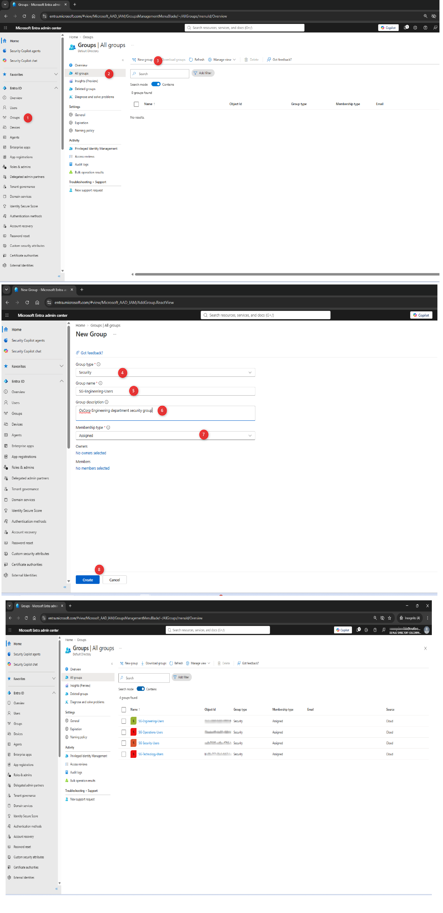
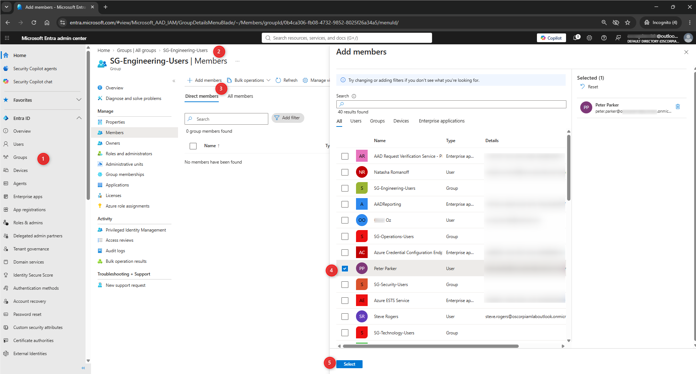
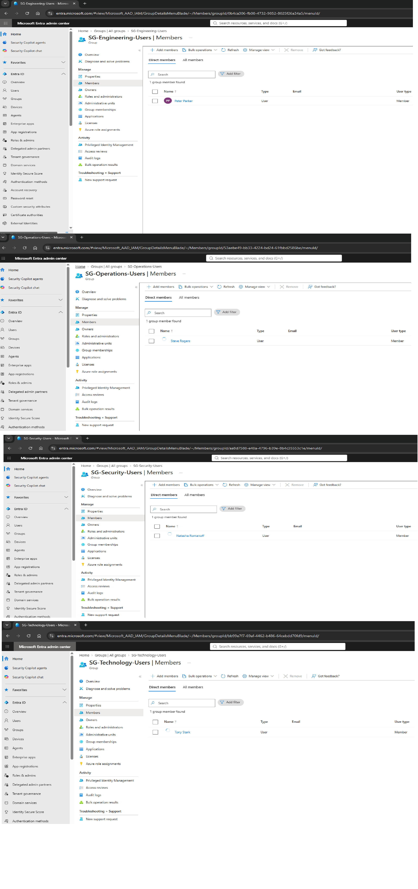
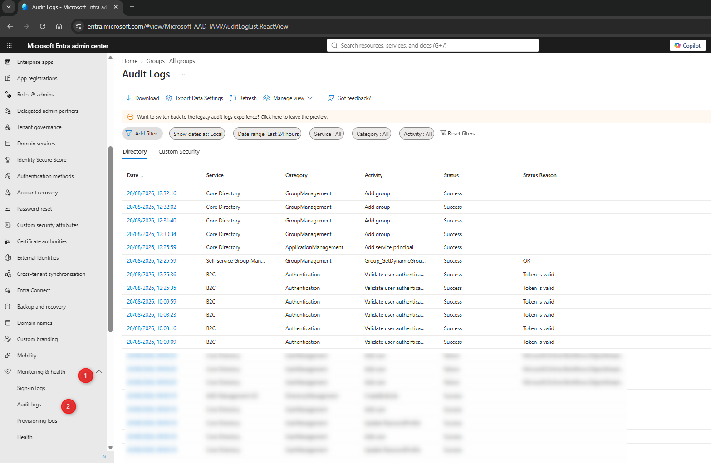
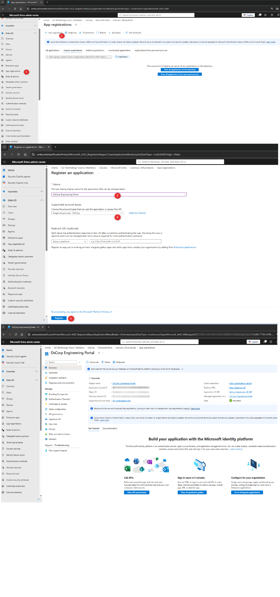

# Lab 02 — Group-Based Access Control 🔐

## Lab Status

**Status:**  ✅ Complete

**Platform:** Microsoft Entra ID

**Organisation:** OsCorp

**Environment:** Azure / Microsoft Entra ID Free

---

## 1. Objective

The objective of this lab is to demonstrate how security groups can be used to organise identities and provide a scalable foundation for access control in Microsoft Entra ID.

The lab will build on the identities created during Lab 01 and demonstrate the relationship between:

```text
User
  ↓
Security Group
  ↓
Access
  ↓
Resource

```
---

The focus is on understanding how group-based access supports:

- Authorization
- Access control
- Least privilege
- Administrative scalability
- Consistent access management
- Identity lifecycle management

## 2. Scenario

OsCorp has successfully provisioned its initial workforce in Microsoft Entra ID.

The next requirement is to organise users according to their business function so that access can be managed through groups rather than by assigning permissions individually to each user.

The IAM administrator has been asked to create department-based security groups and assign the appropriate users to each group.

This approach allows access to be managed at the group level.

For example:

```text
Peter Parker
      ↓
SG-Engineering-Users
      ↓
Engineering Resources

```
If another employee joins the Engineering department, the administrator can add the user to the appropriate group rather than configuring access to every resource individually.


## 3. Existing OsCorp Identities

The users provisioned during Lab 01 will be used in this lab.

| User | Department | Security Group |
|---|---|---|
| Peter Parker | Engineering | `SG-Engineering-Users` |
| Tony Stark | Technology | `SG-Technology-Users` |
| Natasha Romanoff | Security | `SG-Security-Users` |
| Steve Rogers | Operations | `SG-Operations-Users` |

All identities are fictional laboratory accounts based on characters from the Spider-Man and Marvel Cinematic Universe (MCU) universes.

## 4. Group Naming Standard

OsCorp security groups follow the naming convention:

`SG-<Department>-Users`

Where:

**SG** = Security Group

Examples:

- `SG-Engineering-Users`
- `SG-Technology-Users`
- `SG-Security-Users`
- `SG-Operations-Users`

The `SG` prefix is an OsCorp laboratory naming convention.

It does not represent an Entra group type, scope, or permission level

## 5. Group Design

The initial OsCorp group structure will be:
```text
OsCorp
│
├── SG-Engineering-Users
│       └── Peter Parker
│
├── SG-Technology-Users
│       └── Tony Stark
│
├── SG-Security-Users
│       └── Natasha Romanoff
│
└── SG-Operations-Users
        └── Steve Rogers
```
Each group represents a functional department rather than an individual resource permission.

This provides a foundation for assigning access to resources based on business function.

## 6. Why Use Security Groups?

Assigning permissions directly to individual users can become difficult to manage as an organisation grows.

For example:

- `User → Resource`

may work for a small environment, but becomes increasingly difficult to maintain when there are hundreds or thousands of users.

A group-based model allows:
```text
User
  ↓
Group
  ↓
Resource
```
This provides a more scalable approach to access management.

**Benefits**
- Centralised access management
- Easier onboarding
- Easier offboarding
- Reduced administrative effort
- Consistent access assignments
- Easier auditing
- Better support for least privilege
- Reduced risk of individual permission sprawl

## 7. Implementation

Step 1 — Open Microsoft Entra Groups

Navigate to:

**Microsoft Entra admin center → Entra ID → Groups → All groups**

Select:

**+ New group**

**Step 2 — Create Engineering Group**

Configure the group as follows:

**Group type:** 

`Security`

**Group name:**

`SG-Engineering-Users`

**Group description:**

`OsCorp Engineering department security group`

**Membership type:**

`Assigned`

Do not assign any administrative roles to the group.

Create the group.

**Step 3 — Create Technology Group**

Create:

**Group type:**

`Security`

**Group name:**

`SG-Technology-Users`

**Group description:**

`OsCorp Technology department security group`

**Membership type:**

`Assigned`

**Create the group.**

**Step 4 — Create Security Group**

Create:

**Group type:**

`Security`

**Group name:**

`SG-Security-Users`

**Group description:**

`OsCorp Security department security group`

**Membership type:**

`Assigned`

Create the group.

**Step 5 — Create Operations Group**

Create:

**Group type:**

`Security`

**Group name:**

`SG-Operations-Users`

**Group description:**

`OsCorp Operations department security group`

**Membership type:**

`Assigned`

**Create the group.**

## 8. Group Membership

After creating the groups, assign the appropriate users.

**Engineering**

Add:

`Peter Parker`

to:

`SG-Engineering-Users`

**Technology**

Add:

`Tony Stark`

to:

`SG-Technology-Users`

**Security**

Add:

`Natasha Romanoff`

to:

`SG-Security-Users`

**Operations**

Add:

`Steve Rogers`

to:

`SG-Operations-Users`

## 9. Expected Group Membership

After completing the assignments, the expected configuration is:

| Security Group | Members |
|---|---|
| `SG-Engineering-Users` | Peter Parker |
| `SG-Technology-Users` | Tony Stark |
| `SG-Security-Users` | Natasha Romanoff |
| `SG-Operations-Users` | Steve Rogers |

## 10. Validation

After creating the groups and assigning members, validate the configuration.

For each group, verify:

- Group exists
- Group type is Security
- Membership type is Assigned
- Description is correct
- Expected users are members
- No unexpected users are members
- No administrative roles are assigned unnecessarily

The objective is to confirm that the intended identity-to-group relationship has been established.

## 11. Application Registration

To demonstrate application-level authorization, an internal OsCorp application was registered in Microsoft Entra ID.

### Application Details

| Setting | Value |
|---|---|
| Application Name | `OsCorp Engineering Portal` |
| Application Type | Single tenant |
| Identity Provider | Microsoft Entra ID |
| Purpose | Demonstrate group-based application authorization |

The application registration establishes the trust relationship between the OsCorp Engineering Portal and Microsoft Entra ID.

The application will be used later in the lab to demonstrate how an authenticated identity's group membership can influence authorization decisions.

### Implementation

The application was registered through:

**Microsoft Entra ID → App registrations → New registration**

The application was configured as a single-tenant application because the portal represents an internal OsCorp resource.

### Evidence


**Purpose:** Demonstrate the creation and initial configuration of the OsCorp Engineering Portal application registration.

## 12. Access Control Model

The groups created in this lab will later be used to provide access to fictional OsCorp resources.

The intended model is:
```text
Peter Parker
      ↓
SG-Engineering-Users
      ↓
Engineering Resource
```
```text
Rather than:

Peter Parker
      ↓
Direct permission
      ↓
Engineering Resource
```
The group-based model separates identity from resource permissions.

This becomes increasingly important as the number of users and resources grows.

## 13. Least Privilege

Group membership should be based on a legitimate business requirement.

A user should only belong to groups required to perform their role.

For example:

Peter Parker is an Engineering user and therefore belongs to:

`SG-Engineering-Users`

There is no reason to add Peter to:

`SG-Security-Users`

unless a legitimate business requirement exists.

This demonstrates the principle of:

**Least Privilege**

## 14. Authorization Model

The departmental security groups created in this lab provide the foundation for group-based authorization.

For example:

```text
Peter Parker
      ↓
SG-Engineering-Users
      ↓
Engineering Resources

```
The group membership establishes the identity-to-access relationship that can later be consumed by applications and protected resources.

At this stage, the lab focuses on establishing and validating the group-based access model rather than deploying a production application.

Application-level authorization using the OsCorp Engineering Portal will be covered in a later authentication and application security lab.

## 15. Troubleshooting Scenario
**Scenario**

Peter Parker reports that he cannot access an Engineering resource.

The IAM administrator must determine whether the issue is related to group membership.

**Investigation**

The troubleshooting process should follow:

```text
User reports access issue
          ↓
Confirm user identity
          ↓
Check account status
          ↓
Check group membership
          ↓
Confirm SG-Engineering-Users membership
          ↓
Review relevant audit logs
          ↓
Identify cause
          ↓
Remediate
          ↓
Retest
```
**Investigation Checks**

Verify:

- Peter Parker's account exists
- Peter Parker's account is enabled
- Peter Parker belongs to SG-Engineering-Users
- SG-Engineering-Users has the expected access
- No conflicting access control is preventing access

## 16. Audit Evidence

Group creation and membership changes should be auditable.

Microsoft Entra audit logs can be used to investigate:

- Group creation
- Group deletion
- Group membership changes
- User additions
- User removals
- Administrative actions

Navigate to:

**Microsoft Entra ID → Monitoring & health → Audit logs**

Review the relevant events after creating the groups and modifying membership.

The audit evidence should demonstrate:

- Who performed the action
- What action was performed
- Which group was affected
- Which user was affected
- When the action occurred
- Whether the operation succeeded

Audit evidence captured during the lab will be documented in the Evidence section below.

## 17. Evidence

Screenshots captured during the lab will demonstrate the implementation, validation, and access-control testing process.

### Screenshot 01 — Group Creation



**Purpose:** Demonstrate creation of the OsCorp security groups using the defined naming standard.

---

### Screenshot 02 — Engineering Group Membership



**Purpose:** Demonstrate Peter Parker's membership in `SG-Engineering-Users`.

---

### Screenshot 03 — All Group Memberships



**Purpose:** Demonstrate the expected relationship between OsCorp users and departmental security groups.

---

### Screenshot 04 — Group Audit Log



**Purpose:** Demonstrate that group creation and/or membership changes were recorded in Microsoft Entra audit logs.

---

### Screenshot 05 — Application Registration

**Filename:** `05-access-gramted.png`


**Purpose:** Demonstrate the creation of the OsCorp Engineering Portal application registration in Microsoft Entra ID.

---

## 18. Lessons Learned

This section will be completed after the lab has been performed.

Key areas to reflect on:

- Security groups provide a central way to manage users according to business function.
- Group-based access reduces the need to manage permissions individually for every user.
- Group membership can be used as an input into authorization decisions.
- Least privilege should be considered when assigning users to groups.
- Consistent naming conventions make identity environments easier to administer and audit.
- Microsoft Entra audit logs provide useful evidence when investigating identity and group-management activity.
- Application-level authorization is a separate layer from group creation and membership management.

## 19. Lab Outcome

The lab will be considered complete when:

 - SG-Engineering-Users created
 - SG-Technology-Users created
 - SG-Security-Users created
 - SG-Operations-Users created
 - Peter Parker added to SG-Engineering-Users
 - Tony Stark added to SG-Technology-Users
 - Natasha Romanoff added to SG-Security-Users
 - Steve Rogers added to SG-Operations-Users
 - Group memberships validated
 - Naming standards validated
 - Audit logs reviewed
 - Evidence captured
 - Lessons learned documented
 
## 20. Final Result

This lab demonstrates the relationship between identities, groups, authorization, and resources:
```text
Identity
    ↓
Security Group
    ↓
Authorization
    ↓
Resource Access
```
The lab establishes the foundation for managing access through group membership rather than assigning permissions individually to users.

The OsCorp Engineering Portal application registration has also been created as a foundation for the later authentication and application authorization labs.

This approach provides a more scalable and auditable model for Identity and Access Management.

Related Documentation
- [Day 01 — IAM Fundamentals](../README.md)
- [Lab 01 — User Provisioning](../../01-user-provisioning/README.md)
- [OsCorp Environment Setup](../../00-Environment-Setup/README.md)
