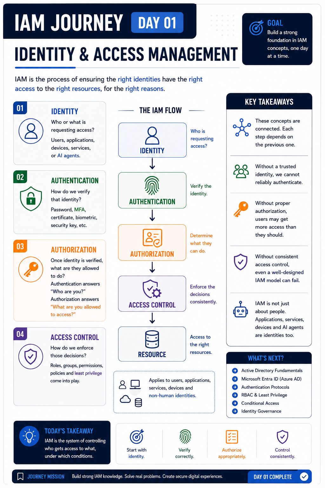

# Day 01 — IAM Fundamentals 🔐

## Overview

Today marks the beginning of my IAM learning journey.

The goal of this journey is to build a practical understanding of Identity and Access Management, moving from fundamental concepts into hands-on labs, troubleshooting scenarios, automation, and real-world identity security use cases.

## What I Learned

### 1. Identity

An identity represents a person, application, device, service, or other entity that may request access to a resource.

The first question IAM needs to answer is:

**Who or what is requesting access?**

### 2. Authentication

Authentication verifies the identity making the request.

Common authentication methods include:

* Passwords
* Multi-factor authentication (MFA)
* Certificates
* Biometrics
* Security keys

The key question is:

**Who are you?**

### 3. Authorization

Authorization determines what an authenticated identity is allowed to access or perform.

The key question is:

**What are you allowed to do?**

### 4. Access Control

Access control is how authorization decisions are enforced.

Common mechanisms include:

* Roles
* Groups
* Permissions
* Policies
* Least privilege

## The IAM Flow

```text
Identity
   ↓
Authentication
   ↓
Authorization
   ↓
Access Control
   ↓
Resource
```

A useful way to remember it:

**Identify → Verify → Authorize → Control → Access**

## Key Takeaway

IAM is about ensuring that the **right identity gets the right access to the right resource under the right conditions**.

One important concept I took away from Day 1 is that IAM is not limited to human users.

Applications, services, devices, and other non-human identities also require identity, authentication, authorization, and appropriate access controls.

## What's Next?

The next stage of the journey will move into:

* Active Directory fundamentals
* Domains and Domain Controllers
* Organizational Units
* Groups and permissions
* Group Policy
* DNS and Active Directory
* Kerberos
* LDAP
* Microsoft Entra ID

## Visual Notes



---

**Day 01 complete. 🔐**

Next: Authentication fundamentals
