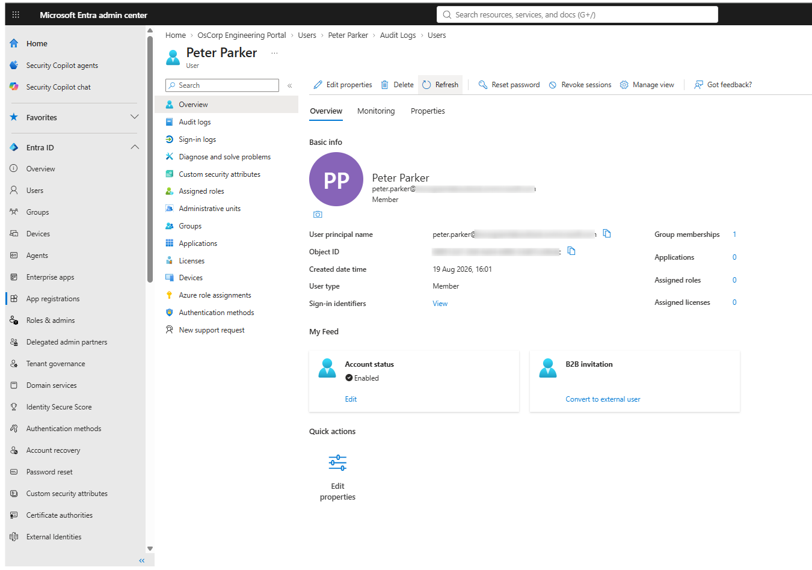
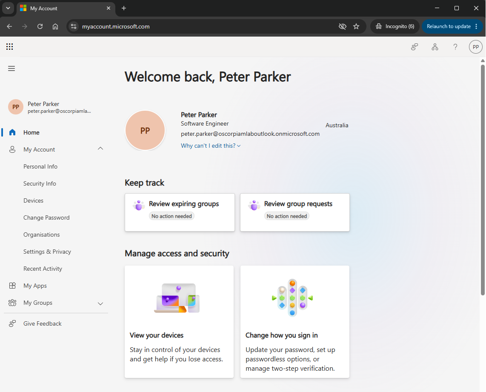
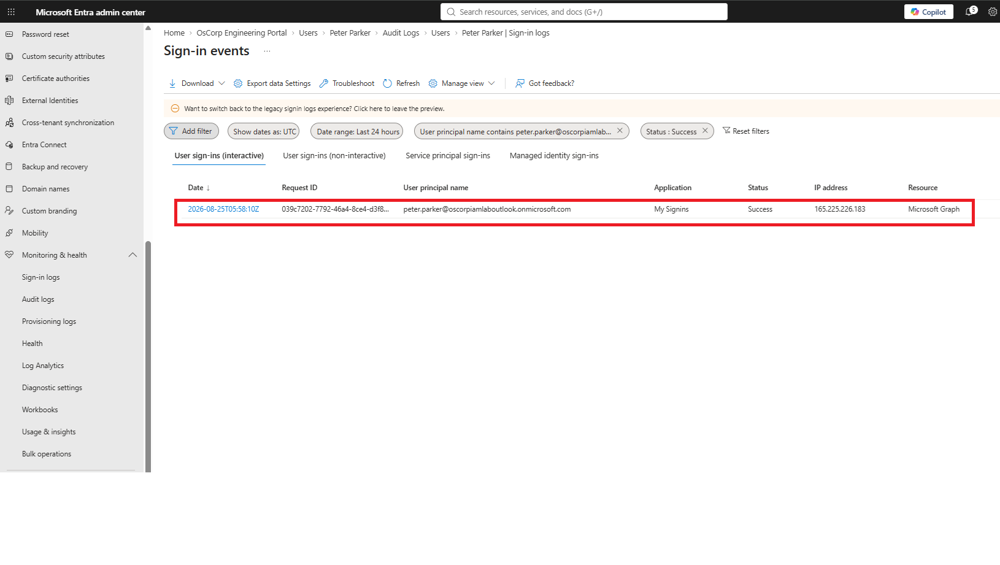
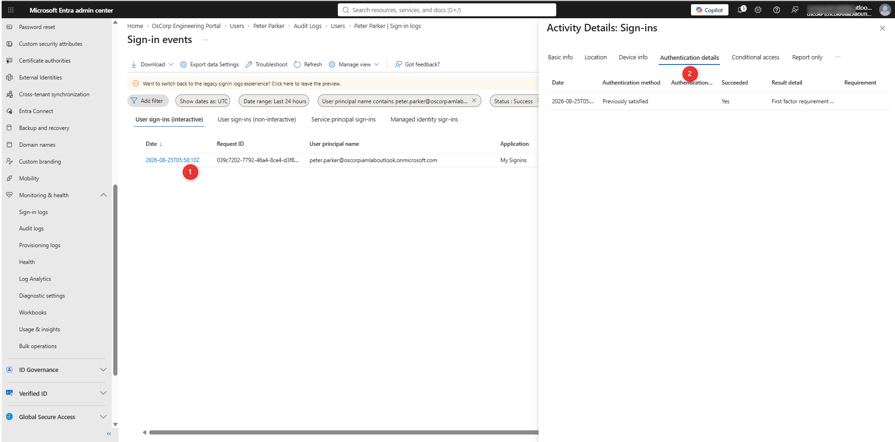

# Lab 01 — Authentication Fundamentals 🔐

## Lab Status

**Status:** 🔄 In Progress

**Platform:** Microsoft Entra ID

**Organisation:** OsCorp

**Environment:** Azure / Microsoft Entra ID Free

---

## 1. Objective

The objective of this lab is to develop a practical understanding of authentication and how Microsoft Entra ID verifies the identity of a user before access is granted to a protected resource.

The lab will demonstrate the relationship between:

```text
Identity
   ↓
Authentication
   ↓
Authentication Result
   ↓
Authorization
   ↓
Resource Access
```

## 2. Authentication vs Authorization

Authentication and authorization are separate IAM processes.

Authentication

Authentication verifies the identity making an access request.

The key question is:

Who are you?

Authorization

Authorization determines what an authenticated identity is allowed to access.

The key question is:

What are you allowed to access?

The relationship can be represented as:
```text
User
  ↓
Authentication
  ↓
Identity Verified
  ↓
Authorization
  ↓
Resource Access
```
A successful authentication does not automatically mean that the user should have unrestricted access to resources.

## 3. Authentication Factors

Authentication factors provide different methods for establishing confidence in an identity.

| Factor | Examples |
|---|---|
| Something you know | Password, PIN |
| Something you have | Authenticator app, security key |
| Something you are | Fingerprint, facial recognition |

Using multiple independent factors increases the difficulty of compromising an identity.

## 4. OsCorp Authentication Identities

The practical exercises will use the fictional OsCorp identities created during the previous IAM labs.

| User | Department | Purpose |
|---|---|---|
| Peter Parker | Engineering | Authentication testing |
| Tony Stark | Technology | Authentication testing |
| Natasha Romanoff | Security | Authentication testing |
| Steve Rogers | Operations | Authentication testing |

## 5. Authentication Flow

A simplified authentication process is:
```text
User
  ↓
Authentication Request
  ↓
Microsoft Entra ID
  ↓
Credential Verification
  ↓
Authentication Result
  ↓
Token / Session
  ↓
Application or Resource
```
Microsoft Entra ID acts as the identity provider for the OsCorp environment.

## 6. Password Authentication

Passwords are a traditional authentication mechanism.

The authentication process can be represented as:
```text
Username
   ↓
Password
   ↓
Microsoft Entra ID
   ↓
Credential Verification
   ↓
Authentication Result
```
Passwords can be targeted through attacks such as:

- Password spraying
- Credential stuffing
- Phishing
- Credential theft
- Password reuse

For this reason, password-only authentication provides weaker protection than authentication methods using additional factors.

## 7. Practical Exercise — Authentication

The first practical exercise will establish a baseline authentication process using an OsCorp user account.

## Test Identity

User: Peter Parker

Objective

Demonstrate that:

**1.** Peter Parker exists in Microsoft Entra ID.
**2.** The account is enabled.
**3.** The identity can authenticate successfully.
**4.** The authentication event is recorded by Microsoft Entra.
**5.** The resulting sign-in activity can be investigated.

## 8. Implementation

The authentication test will be performed using the existing OsCorp Microsoft Entra environment.

The administrator will:

**1.** Locate Peter Parker in Microsoft Entra ID.
**2.** Confirm that the account is enabled.
**3.** Initiate an authentication attempt.
**4.** Complete the authentication process.
**5.** Confirm successful authentication.
**6.** Review the resulting sign-in activity.

## 9. Validation

The authentication process should be validated using Microsoft Entra sign-in information.

The validation should confirm:

| Check	| Expected Result | 
|---|---|
| User exists| 	Yes | 
| Account enabled| 	Yes | 
| Authentication attempt | 	Recorded | 
| Authentication result | 	Successful | 
| Sign-in event | 	Present | 
| User identity | 	Peter Parker | 

## 10. Sign-In Logs

Microsoft Entra sign-in logs provide information that can be used to investigate authentication activity.

Navigate to:

Microsoft Entra ID → Monitoring & health → Sign-in logs

The relevant sign-in event should be reviewed for information such as:

- User
- Date and time
- Application
- IP address
- Location
- Authentication requirement
- Authentication method
- Result
- Failure reason, if applicable

The sign-in logs will become increasingly important during the MFA and authentication troubleshooting labs.

## 11. Authentication Troubleshooting

Authentication failures should be investigated systematically rather than assuming that the password is incorrect.

A basic troubleshooting process is:
```text
User reports authentication problem
             ↓
Identify the user
             ↓
Check account status
             ↓
Review sign-in logs
             ↓
Review authentication details
             ↓
Identify failure reason
             ↓
Remediate
             ↓
Retest
             ↓
Validate sign-in logs
```
This approach provides a repeatable method for investigating authentication incidents.

## 12. Evidence

Screenshots will be captured during the lab to demonstrate the authentication process and validation activities.

## Screenshot 01 — Peter Parker Identity



Purpose: Demonstrate Peter Parker's identity and enabled account status in Microsoft Entra ID.

## Screenshot 02 — Authentication Result



Purpose: Demonstrate the result of Peter Parker's authentication attempt.

## Screenshot 03 — Sign-In Log



Purpose: Demonstrate that Peter Parker's authentication activity was recorded in Microsoft Entra sign-in logs.

## Screenshot 04 — Authentication Details



Purpose: Demonstrate the authentication details associated with the sign-in event.

## 13. Lessons Learned

This section will be completed after the practical exercise.

Key areas to reflect on:

- What is authentication?
- How is authentication different from authorization?
- Which authentication factors were involved?
- How does Microsoft Entra act as an identity provider?
- What information is available in sign-in logs?
- How can authentication failures be investigated?
- Why is password-only authentication less secure than MFA?

## 14. Lab Outcome

The lab is complete when:

 - Authentication concepts understood
 - Authentication vs authorization documented
 - Authentication factors documented
 - Peter Parker authentication tested
 - Authentication result validated
 - Sign-in logs reviewed
 - Authentication details reviewed
 - Evidence captured
 - Troubleshooting methodology documented
 - Lessons learned completed

 
## Related Documentation
- [Day 02 — Authentication](../01-authentication-fundamentals/README.md)
- [Day 01 — IAM Fundamentals](../README.md)
- [Lab 01 — User Provisioning](../01-user-provisioning/README.md)
- [Lab 02 — Group-Based Access Control](../02-group-based-access/README.md)
- [OsCorp Environment Setup](../../00-Environment-Setup/README.md)
